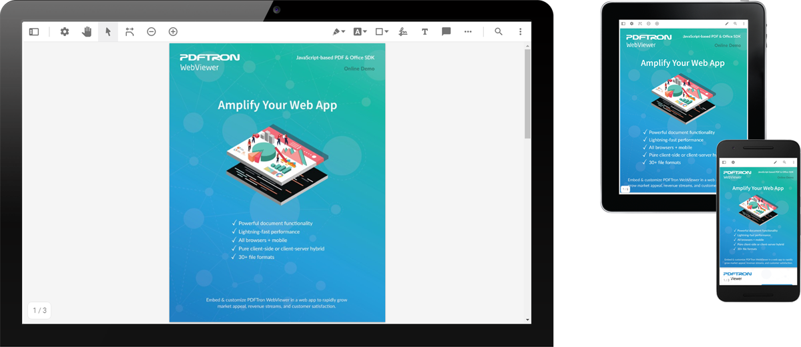

# WebViewer UI

WebViewer UI sits on top of [WebViewer](https://www.pdftron.com/webviewer), a powerful JavaScript-based PDF Library that's part of the [PDFTron PDF SDK](https://www.pdftron.com). Built in React, WebViewer UI provides a slick out-of-the-box responsive UI that interacts with the core library to view, annotate and manipulate PDFs that can be embedded into any web project.



This repo is specifically designed for any users interested in advanced customizations. With the source code access, it gives developers full control to customize & style the UI, build custom controls & logic, integrate into workflows, or build a UI from scratch.

## Initial setup

To work with this repo, you must download the latest WebViewer and link it to this repo.

1. Download [WebViewer](https://www.pdftron.com/documentation/web/guides/run-samples).
2. Follow steps from [forking WebViewer](https://www.pdftron.com/documentation/web/guides/ui/advanced-customization#forking-and-linking).

Now you can navigate to `WebViewer/lib/ui` and run the commands to install, run and build.

## Install

```
npm install
```

## Run

```
npm start
```

## Build

```
npm run build
```

## Project structure

```
src/
  apis/            - APIs exposed in myWebViewer.getInstance()
  components/      - React components
  constants/       - JavaScript or CSS constants
  core/            - APIs from the Core
  event-listeners/ - Listeners for the Core events
  helpers/         - Reused functions
  redux/           - Redux files for state managing
```

## API documentation

See [API documentation](https://www.pdftron.com/documentation/web/guides/ui/apis).

## Contributing

See [contributing](./CONTRIBUTING.md).

## License

See [license](./LICENSE).
